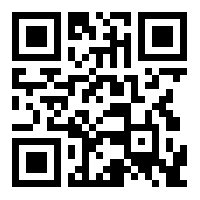

# TP PPS (ReComiendo)


### Programadores :iphone:

``` 
- María Belén Mayo
- Matias Palmieri
- Maximiliano Vargas
```


### Organización y Tecnologias :question:

Para organización interna del grupo decidimos armar un [Trello](https://trello.com/b/klTX895E/restaurant) y un canal de Discord.
Nuestro proyecto esta conectado a [Firebase](https://console.firebase.google.com/project/restaurantapp-3405c/overview), donde usaremos a la
misma como nuestro gestor de datos.


### Codigos QR :question:

#### Mesa 1


#### Mesa 2


#### Mesa 3


#### Mesa 4


# Lista de espera



### Calificación para propinas QR :question:

#### Propina Excelente


#### Propina Muy Bien


#### Propina Bien


#### Propina Regular


#### Propina Mala


# Paso a Paso


### Sprint 0 - 22/05/2021 al 29/06/2021

```
- Armado de distintos canales de comunicación interna del grupo (Discord, Grupo de WhatsaApp)
- Armado y carga de tareas en el Trello.
- Armado del marco de trabajo.
```

### Sprint 1 - 29/05/2021 al 05/06/2021

```
- Armado de Login, armado de servicios esenciales firebase y utilidad(Maxi)
- Armado de Registro, armado de servicios esenciales qr y sppiner (Belén)
- Armado de Home y Navbar, armado de servicios esenciales vibración y pedidos (Matías)
```

### Sprint 2 - 05/06/2021 al 12/06/2021

```
- Creación del ícono, componente cliente (Maxi)
- Creación del splash, componente dueño/supervisor (Belén)
- Componente Login, componente mozo (Matías)
```

### Sprint 3 - 12/06/2021 al 19/06/2021

```
- Componente bartender, pipes (Maxi)
- Componente cocinero, guards (Belén)
- componente metre, modificación de servicios (Matías)
```

### Sprint 4 - 19/06/2021 al 26/06/2021

```
- Componente solicitudes, arreglos generales, grabado de videos (Maxi)
- Componente listadoPedidos, arreglos generales, grabado de videos (Belén)
- Componente menu, arreglos generales, grabado de videos (Matías)
```

### Sprint 5 - 26/06/2021 al 03/07/2021

```
- Revisión general de validaciónes, grabado de videos, push notifications, email de registro, spinners(Maxi)
- Revisión general de validaciónes, grabado de videos, QR Propinas, Usuario anonimo, alta cliente(Belén)
- Revisión general de validaciónes, grabado de videos, Graficos de encuesta, inputs de encuesta (Matías)
```

### Sprint 6 - 03/07/2021 al 10/07/2021

```
A partir de este SPRINT comenzamos a trabajar únicamente en las correcciones de los profesores y ayudantes
- Validación no permitir asignar mesas ya asignadas, revisión de acentos(Maxi)
- Gráfico de torta, Estilos global de la app (Se ajusta a pedido del profesor)(Belén)
- Tiempo a las comidas, Se agrandó la fuente en los importes del MENU(Matías)
```

### Sprint 7 - 10/07/2021 al 13/07/2021

```
Continuamos con correcciones pendientes
- Chat del mozo y push notification de respuesta que hay una pregunta al mozo(Maxi)
- Cambios de mensajes, Fix de QR, propinas (Belen)
- Toast de creación de usuario exitoso y spinner agregado cuando carga la información de las estadisticas(Matias)
```

### Sprint 8 - 14/07/2021 al 17/07/2021

```
Se trabajó en conjunto (vía llamada) en la corrección de los puntos mencionados en la pre entrega con nota (tarea 03/07).
```
